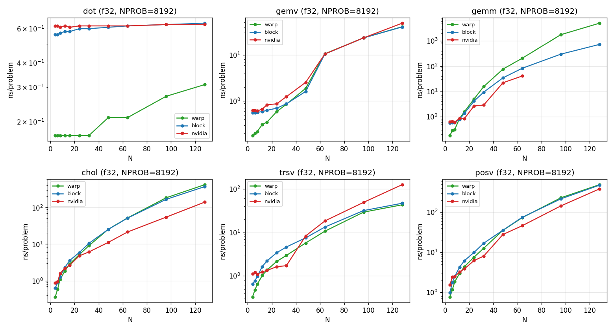
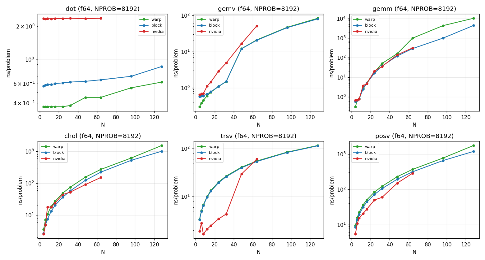

GLASS: GPU Linear Algebra Simple Subroutines
============================================

`GLASS <http://a2r-lab.org/GLASS/>`_ **is a comprehensive, header-only CUDA C++**
``__device__`` **template library for block-local linear algebra on GPUs.** It is
the foundational linear-algebra layer underneath
`GRiD <https://github.com/A2R-Lab/GRiD>`_,
`MPCGPU <https://a2r-lab.org/publication/mpcgpu/>`_,
`GATO <http://a2r-lab.org/GATO/>`_,
`HJCD-IK <https://a2r-lab.org/publication/hjcdik/>`_, and other A2R Lab GPU solvers.

Like Eigen on the CPU, GLASS aims to be *comprehensive* — it covers all
block-local linear algebra in one consistent ``__device__`` calling convention:
**BLAS** (L1/L2/L3), **LAPACK-style factorizations and triangular solves**
(Cholesky, LDLᵀ, and LU/QR via vendor backends), **dense linear-system solvers**
(``posv`` / ``ldlt`` / ``gesv``), and **related algorithms** — block-tridiagonal
``bdmv`` / ``pcg`` for trajectory optimization and MPC, plus a contraction-parallel
+ fused family. You launch one block per independent problem; the block's threads
cooperate over data already resident in shared or global memory.

Interfaces
----------

GLASS exposes **three primary interfaces** — pick the one that matches how your
problem maps onto the GPU. They cover the same operations under one calling
convention, so you switch between them by changing the namespace prefix:

.. grid:: 3
   :gutter: 3

   .. grid-item-card:: Block — ``glass::``
      :link: user_guide/getting_started/library_overview
      :link-type: doc

      The default. One **block** per problem; the block's threads cooperate over
      shared/global data. Pure SIMT, **no dependencies**
      (``#include "glass.cuh"``). Choose this for a single moderate-to-large
      problem per block.

   .. grid-item-card:: Warp — ``glass::warp::``
      :link: api_reference/warp
      :link-type: doc

      One **warp** per problem (``__shfl_*_sync``, no ``__syncthreads``), so warps
      run independently. Choose this to pack **many small independent problems**
      into one block for intra-block parallelism. Requires a full 32-lane warp.

   .. grid-item-card:: Nvidia — ``glass::nvidia::``
      :link: user_guide/concepts/backend_dispatch
      :link-type: doc

      CUB / cuBLASDx / cuSOLVERDx, auto-dispatched against SIMT by size. Choose
      this when a vendor **tensor-core** kernel wins at your size (needs NVIDIA
      MathDx).

.. note::

   ``glass::cgrps::`` is a convenience cooperative-groups *alias* of the **Block**
   interface — identical numerics (the same SIMT loop, indexed via a
   ``thread_group`` handle), for callers already in a cooperative-groups context
   or tiling arbitrary sub-block groups. It is **not** a separately-tuned backend.
   ``#include "glass-cgrps.cuh"``.

Performance
-----------

The three interfaces are numerically interchangeable, so GLASS can pick the
fastest one per ``(operation, size, dtype)`` from a measured ladder:
``glass::suggested_backend<op, N, T>()`` returns the winning interface and a
launch config for codegen and host-side dispatch. The shipped defaults are tuned
on an RTX 5090 (sm_120); you can regenerate the table for your own GPU with the
GLASS autotune workflow. See :doc:`user_guide/concepts/tuning` for how the
benchmarks drive the defaults, and the :ref:`measured ladders <measured-performance>`
at the bottom of this page.

The **contraction-parallel + fused family** (``gemm_reduced`` / ``gemv_reduced`` /
``syrk_reduced``, the ``tensor_vec_contract`` / ``vec_tensor_vec`` /
``congruence_sym`` / ``bilinear`` ops, ``riccati_gain``, and compile-out
robustness flags on ``cholDecomp_InPlace`` / ``ldlt`` / ``posv``) targets dense
trajectory-knot work — see :doc:`user_guide/concepts/contraction_parallel` (mind
its measured perf caveat) and :doc:`user_guide/concepts/namespaces` for the
naming convention.

.. grid:: 2
   :gutter: 3

   .. grid-item-card:: Get started
      :link: user_guide/getting_started/installation
      :link-type: doc

      Header-only install, the single-block execution model, and an optional
      MathDx setup for the ``glass::nvidia::`` backend.

   .. grid-item-card:: API reference
      :link: api_reference/index
      :link-type: doc

      The L1 / L2 / L3 and NVIDIA device functions, generated from the header
      doc-comments via Doxygen + Breathe.

Quick start
-----------

.. code-block:: cpp

   #include "glass.cuh"

   // One block solves one problem; threads stride over the data.
   __global__ void saxpy_kernel(uint32_t n, float a, float *x, float *y) {
       glass::axpy(n, a, x, y);          // y = a*x + y
   }

   saxpy_kernel<<<1, 256>>>(n, 2.0f, d_x, d_y);

See :doc:`user_guide/tutorials/quickstart` for a complete, compilable example,
and :doc:`user_guide/tutorials/examples` for a worked program per concept.

.. _measured-performance:

Measured performance
--------------------

The measured warp / block / nvidia ladder on an RTX 5090 (sm_120) — each op's
fastest interface across problem size, in ns/problem (the data behind
``glass::suggested_backend<>``), shown here in the ``NPROB=8192`` throughput
regime:

See :doc:`user_guide/tutorials/sweep_results` for the same ladder across the
``NPROB=64`` / ``1024`` / ``8192`` batch regimes (the winner shifts with batch
size) and the per-``(op, N)`` winner table, and :doc:`user_guide/concepts/tuning`
to regenerate it for your own GPU with ``bench/tune.py``.

.. toctree::
   :hidden:
   :caption: Getting Started

   user_guide/getting_started/index

.. toctree::
   :hidden:
   :caption: Concepts

   user_guide/concepts/index

.. toctree::
   :hidden:
   :caption: Tutorials

   user_guide/tutorials/index

.. toctree::
   :hidden:
   :caption: API Reference

   api_reference/index

.. toctree::
   :hidden:
   :caption: Developer Guide

   contribution_guidelines
   sphinx_edit_guide
