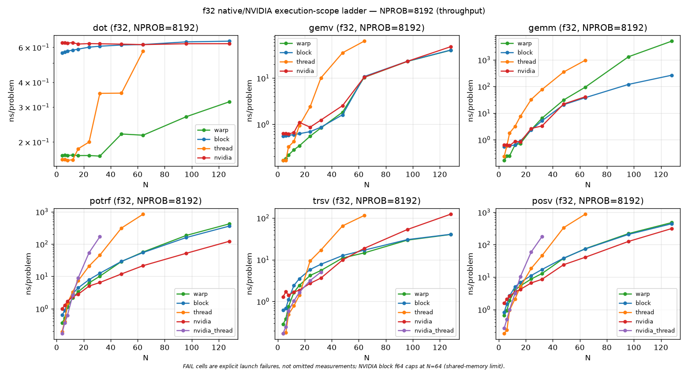
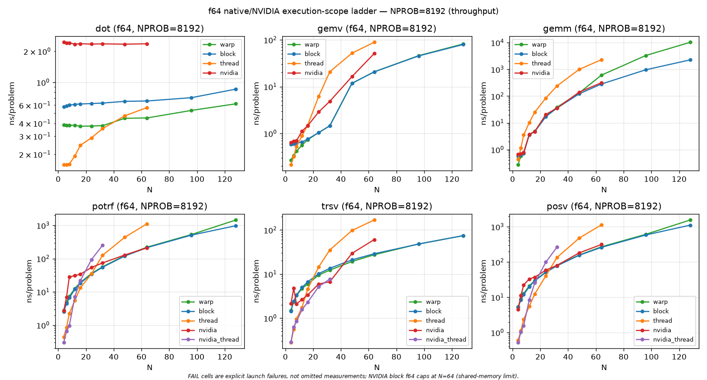

GLASS: GPU Linear Algebra Simple Subroutines
============================================

`GLASS <http://a2r-lab.org/GLASS/>`_ is a header-only CUDA C++ library of
composable ``__device__`` primitives for small, block-local linear algebra and
robotics math. It is
the foundational linear-algebra layer underneath
`GRiD <https://github.com/A2R-Lab/GRiD>`_,
`MPCGPU <https://a2r-lab.org/publication/mpcgpu/>`_,
`GATO <http://a2r-lab.org/GATO/>`_,
`HJCD-IK <https://a2r-lab.org/publication/hjcdik/>`_, and other A2R Lab GPU solvers.

The library covers BLAS, factorizations and solvers, structured systems, spatial
algebra, Lie groups, projections, and small estimation kernels. Block-scoped
operations compose inside a caller-owned kernel; selected warp- and
thread-scoped forms pack smaller independent problems more densely. See the
:doc:`API reference <api_reference/index>` for the exact surface and
:doc:`robotics conventions <user_guide/concepts/robotics_conventions>` for the
load-bearing layout choices.

Interfaces
----------

GLASS separates **execution scope** (thread, warp, or block) from
**implementation family** (dependency-free GLASS code or optional NVIDIA
libraries). The spellings intentionally overlap, but do not all expose every
operation.

.. grid:: 2
   :gutter: 3

   .. grid-item-card:: Block — ``glass::block::``
      :link: user_guide/getting_started/library_overview
      :link-type: doc

      One **block** per problem; the block's threads cooperate over
      shared/global data. Pure SIMT, **no dependencies**
      (``#include "glass.cuh"``). This explicit implementation is never
      re-dispatched.

   .. grid-item-card:: Warp — ``glass::warp::``
      :link: api_reference/warp
      :link-type: doc

      One **warp** per problem (``__shfl_*_sync``, no ``__syncthreads``), so warps
      run independently. Choose this to pack **many small independent problems**
      into one block for intra-block parallelism. Requires a full 32-lane warp.

   .. grid-item-card:: Thread — ``glass::thread::``
      :link: api_reference/thread
      :link-type: doc

      One problem per **thread**, 32 packed per warp. This is a compile-time,
      branch-free subset intended for register-resident sizes up to ``N≤7``.

   .. grid-item-card:: Nvidia — ``glass::nvidia::block::``
      :link: user_guide/concepts/backend_dispatch
      :link-type: doc

      CUB / cuBLASDx / cuSOLVERDx at block scope. Choose this when the measured
      vendor implementation wins at your size (needs NVIDIA MathDx).

   .. grid-item-card:: Nvidia warp — ``glass::nvidia::warp::``
      :link: api_reference/nvidia
      :link-type: doc

      CUB ``WarpReduce`` L1 reductions, one full 32-lane warp per problem and
      explicit per-warp scratch.

   .. grid-item-card:: Nvidia thread — ``glass::nvidia::thread::``
      :link: api_reference/nvidia
      :link-type: doc

      cuSOLVERDx 0.4+ LAPACK, one independent packed problem per CUDA thread;
      no dynamic shared scratch or block-wide synchronization.

.. note::

   ``glass::cgrps::`` is a convenience cooperative-groups *alias* of the **Block**
   interface — identical numerics (the same SIMT loop, indexed via a
   ``thread_group`` handle), for callers already in a cooperative-groups context
   or tiling arbitrary sub-block groups. It is **not** a separately-tuned backend.
   ``#include "glass-cgrps.cuh"``.

.. note::

   **Bare** ``glass::op`` (and bare ``glass::nvidia::op``) is the
   **measured-default face**: the same block-scope calling contract, with the
   implementation body chosen per (op, size, dtype) by
   ``glass::dispatch_body()`` (``glass-dispatch.cuh``, regenerated by the
   measured ``tune.py --legs body`` sweep). The selection is a ``constexpr``
   decision **inside the device function** — resolved per call site at compile
   time, with no host-side dispatcher and no runtime branch. Cells with a
   robust measured win route to a warp- or thread-body inside the block; every other name is the
   *same entity* as ``glass::block::``, and all pre-restructure spellings
   compile unchanged. Determinism-sensitive callers pin ``glass::block::``
   explicitly; see :doc:`user_guide/concepts/namespaces`.

Measured defaults
-----------------

``glass::suggested_backend<op, N, T>()`` exposes architecture-specific measured
defaults for operations included in the tuning ladder. Measurements are not a
promise that interfaces have identical coverage or reduction order. See
:doc:`user_guide/concepts/tuning` for the selection policy and
:doc:`user_guide/tutorials/sweep_results` for dated, configuration-specific
results.

.. grid:: 2
   :gutter: 3

   .. grid-item-card:: Get started
      :link: user_guide/getting_started/installation
      :link-type: doc

      Header-only install, the single-block execution model, and an optional
      MathDx setup for the ``glass::nvidia::`` backend.

   .. grid-item-card:: API reference
      :link: api_reference/index
      :link-type: doc

      The L1 / L2 / L3 and NVIDIA device functions, generated from the header
      doc-comments via Doxygen + Breathe.

Quick start
-----------

.. code-block:: cpp

   #include "glass.cuh"

   // One block solves one problem; threads stride over the data.
   __global__ void saxpy_kernel(uint32_t n, float a, float *x, float *y) {
       glass::axpy(n, a, x, y);          // y = a*x + y
   }

   saxpy_kernel<<<1, 256>>>(n, 2.0f, d_x, d_y);

See :doc:`user_guide/tutorials/quickstart` for a complete, compilable example,
and :doc:`user_guide/tutorials/examples` for a worked program per concept.

.. _measured-performance:

Measured performance
--------------------

The measured warp / block / nvidia ladder on an RTX 5090 (sm_120) — each op's
fastest interface across problem size, in ns/problem (the data behind
``glass::suggested_backend<>``), shown here in the ``NPROB=8192`` throughput
regime:

See :doc:`user_guide/tutorials/sweep_results` for the same ladder across the
``NPROB=64`` / ``1024`` / ``8192`` batch regimes (the winner shifts with batch
size), a narrowly configured host-batched cuBLAS/cuSOLVER comparison, the fused
``riccati_gain`` case study, and the per-``(op, N)`` winner table; see
:doc:`user_guide/concepts/tuning` to regenerate everything for your own GPU
with ``bench/tune.py``.

.. toctree::
   :hidden:
   :caption: Getting Started

   user_guide/getting_started/index

.. toctree::
   :hidden:
   :caption: Concepts

   user_guide/concepts/index

.. toctree::
   :hidden:
   :caption: Tutorials

   user_guide/tutorials/index

.. toctree::
   :hidden:
   :caption: API Reference

   api_reference/index

.. toctree::
   :hidden:
   :caption: Developer Guide

   contribution_guidelines
   sphinx_edit_guide
